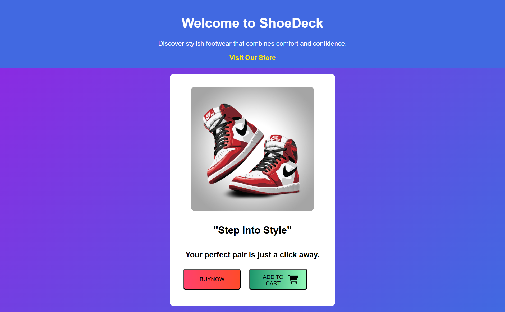

# 🩰 Shoe Product Card Website
### 🎯 ApexPlanet Internship – Task 1: Basics of Web Development

This project is created as part of the **ApexPlanet 45-Days Web Development Internship**.  
The goal of Task-1 was to apply foundational **HTML**, **CSS**, and **JavaScript** concepts to build a simple yet attractive web page.

---

## 📄 Project Overview
A clean and interactive product card webpage that displays a shoe item with title, description, and two action buttons — **Buy Now** and **Add to Cart**.  
Both buttons are functional using JavaScript alert messages for basic interactivity.

---

## 🧩 Features
- 🏗️ Built with **HTML** for structure  
- 🎨 Styled using **CSS gradients, spacing, and hover effects**  
- ⚙️ Added **JavaScript alerts** for button actions  
- 📱 Fully centered, minimal, and responsive layout  

---

## 🛠️ Technologies Used
- **HTML5**  
- **CSS3**  
- **JavaScript (ES6)**  

---

## 🚀 How to Run
1. Clone or download this repository.  
2. Open the `index.html` file in any browser.  
3. Click on the **Buy Now** or **Add to Cart** buttons to see the alert interactions.

---

## 📸 Preview

---

## 🧠 Learning Outcome
- Gained hands-on practice with basic web development fundamentals.  
- Improved understanding of CSS styling and button hover transitions.  
- Learned to link HTML, CSS, and JavaScript files together effectively.

---

## 👩‍💻 Author
**Raja Shreenivas Reddy**  
[LinkedIn Profile](https://www.linkedin.com/in/raja-shreenivas-reddy-472265304)  
[GitHub Profile](https://github.com/RAJASHREENIVASREDDY)

---

## 📚 Internship Info
This project is part of **ApexPlanet Software Pvt. Ltd. – 45 Days Web Development Internship**  
**Task 1:** Basics of Web Development (HTML, CSS, JavaScript)
