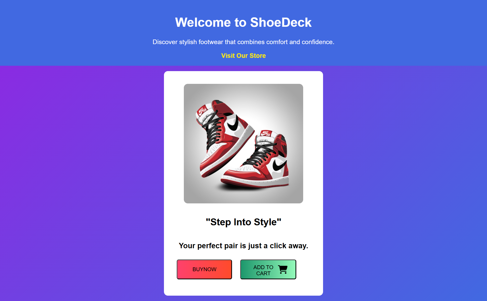

# 🛍️ Shoe Product Card - HTML & CSS Project

This project is a visually appealing product card layout designed using only **HTML** and **CSS**. It's built as part of my full-stack web development learning journey.

## 🔍 Features

- Clean UI with modern gradients
- Responsive and centered layout
- Product image with title and subtitle
- Two action buttons:
  - **Buy Now**
  - **Add to Cart** (with SVG icon)
- Smooth hover effects using Flexbox

## 💻 Technologies Used

- HTML5
- CSS3 (Flexbox, Gradients, Transitions)
- SVG for cart icon

## 📸 Preview

 <!-- Replace with your image path if you upload one -->

## 🚀 Getting Started

To run this project locally:

1. Download or clone the repository.
2. Open `index.html` in your browser.

## 📂 Folder Structure

/shoe-product-card
│
├── index.html
├── styles.css (if separate)
├── images/
│ └── shoes.png

## 🙌 Acknowledgments

Built as part of my HTML + CSS practice while learning full-stack web development.

---

> Feel free to fork, improve, or share!

